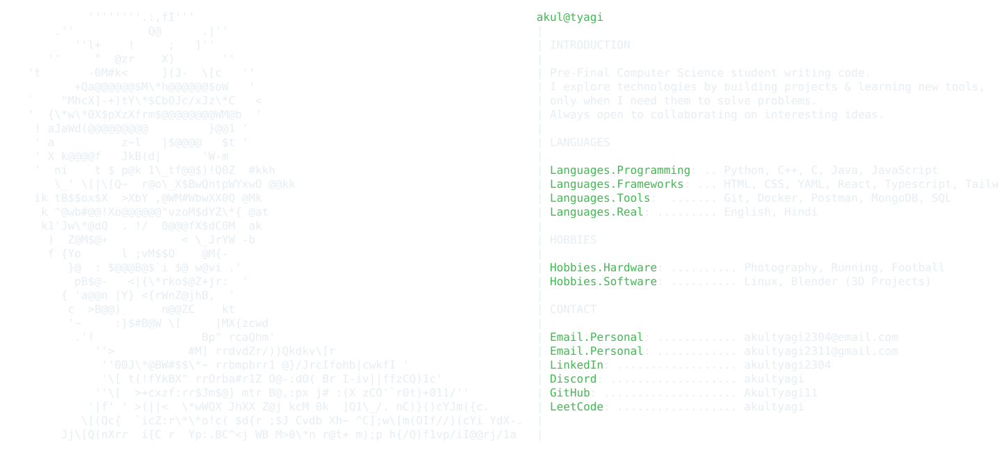

  <picture>
    <source media="(prefers-color-scheme: dark)" srcset="profile-card-dark.svg">
    <source media="(prefers-color-scheme: light)" srcset="profile-card-light.svg">
    
  </picture>

***

# GitHub Stats:

